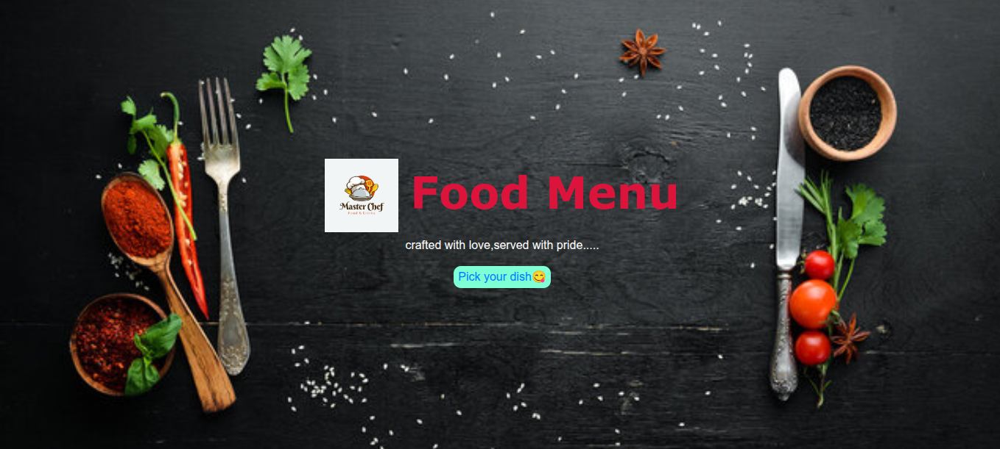
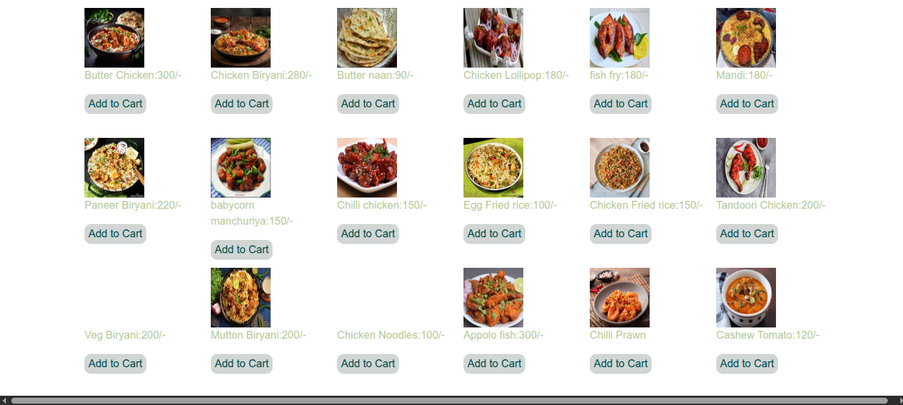

# Food Menu Web Application

A responsive web application that displays a variety of food items in a structured and visually appealing menu layout.

## 🚀 Features
- Categorized food items (e.g., starters, main course, desserts)
- Responsive design for mobile and desktop
- Clean and user-friendly UI
- Interactive elements for better user experience

## 📸 Screenshots

### 🍽️ Menu Page

### 📱 Responsive View

## 🛠️ Tech Stack
- HTML
- CSS
- JavaScript

## 📂 Project Structure
- index.html
- style.css
- script.js

## 👩‍💻 Author
Vyshnavi
